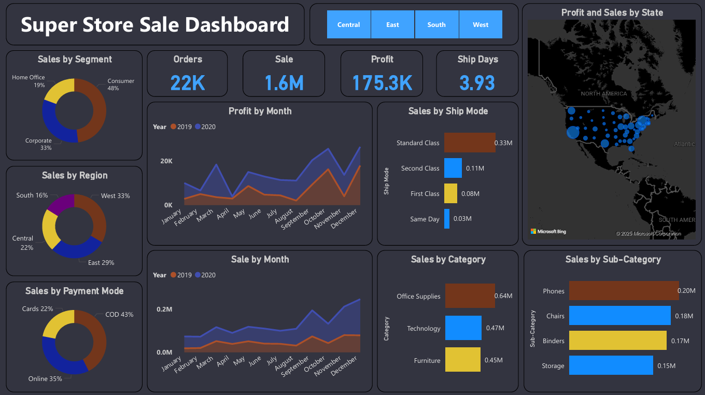
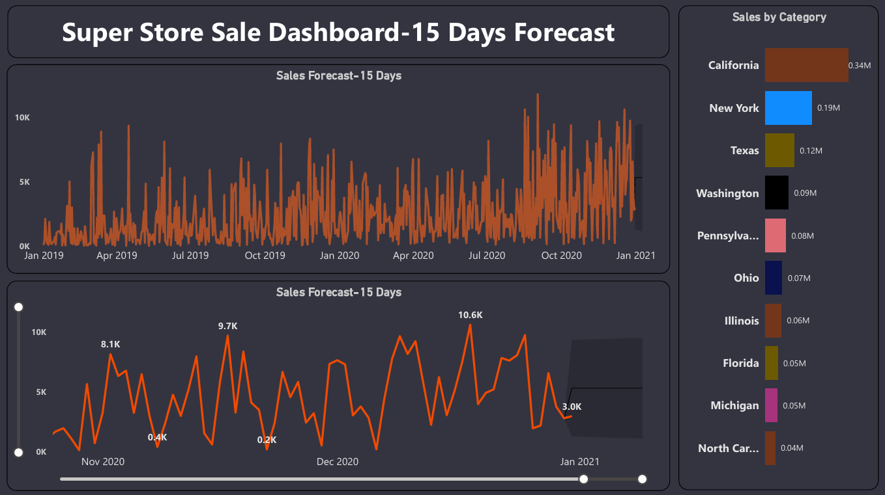

# 📊 Super Store Sales Analysis Dashboard – Power BI

This project presents an interactive **Super Store Sales Analysis Dashboard** built in **Power BI** to explore sales performance, profitability, customer segments, and regional trends. The dashboard converts raw transactional data into actionable business insights for decision‑making.

---

## 📸 Dashboard Preview

---

## 🔍 Project Overview

The dashboard provides insights into:

* Total Sales, Profit, Orders, and Average Ship Days
* Sales by Category and Sub‑Category
* Monthly Sales & Profit Trends (2019–2020)
* Regional and State‑wise Sales Performance
* Customer Segments (Consumer, Corporate, Home Office)
* Sales by Ship Mode and Payment Mode
* 15‑Day Sales Forecast for short‑term planning

---

## 🧠 Skills Demonstrated

* Data Cleaning & Transformation with Power Query
* Data Modeling & Relationships
* DAX Measures & KPI Creation
* Time‑Series Trend Analysis
* Sales Forecasting
* Dashboard Design & Visual Storytelling
* Business Insight Generation

---

## 🛠 Tools Used

* Power BI Desktop
* Power Query
* DAX
* Star‑schema style data modeling

---

## 🎯 Objective

To transform raw retail sales data into meaningful insights that help businesses:

* Understand category and regional performance
* Track monthly sales and profit trends
* Identify high‑value customer segments
* Optimize shipping and payment strategies
* Support data‑driven sales forecasting and planning

---

## 📊 Dataset

Sample Super Store dataset used for educational and portfolio purposes.

---

⭐ If you found this project useful, feel free to star the repository or connect with me.

🚀 Always learning and building — open to feedback and collaboration.
